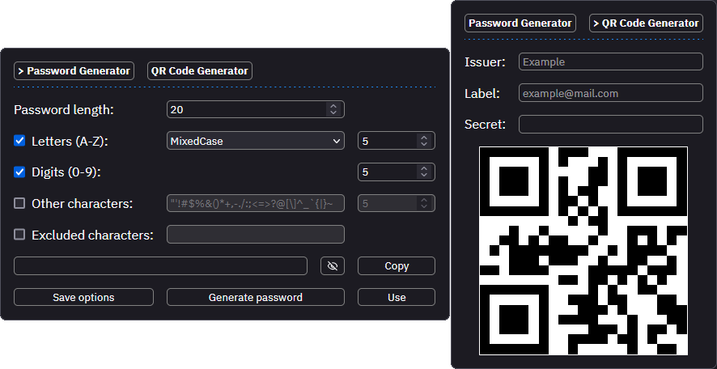

# Secure Password Generator

Browser extension to generate random passwords and QR codes.

      
  ⠀
    ⠀
    

### Secure Random Password Generator

Generate cryptographically secure random passwords with customizable options.

Each time an option is modified, it is saved in the **session** storage. \
Items in the session storage area are stored in-memory and will not be persisted to disk.

Click the `Save options` button to save the options in the **local** store. \
Items in the local storage area stored locally and cleared when the extension is removed.

The `password` and QR code `secret` fields are never stored in the local storage.

The UI and functionality is based on [`@mar-kolya\secure-password-generator`][spg].

### QR Code Generator

Generate a QR code given a `issuer`, `label` and `secret` value.

> otpauth://totp/ISSUER:LABEL?secret=SECRET&issuer=ISSUER

If the `issuer` or `label` fields are empty, generates a QR code using the `secret`.

## License

This project is licensed under the **GNU General Public License v3.0**.
See the [license file](LICENSE) for details.

<!-- Reference Links -->
[spg]: https://github.com/mar-kolya/secure-password-generator
