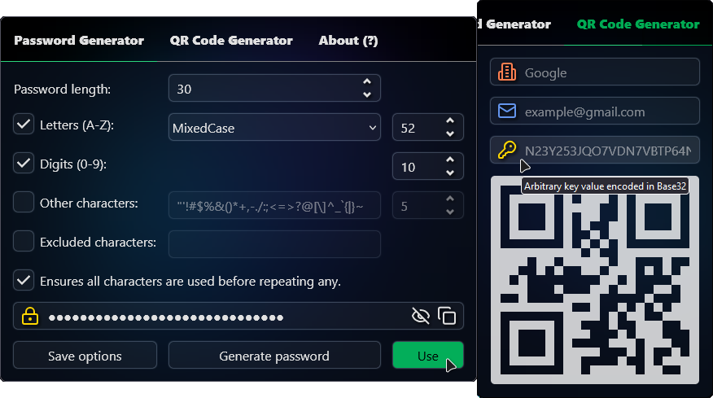

# Secure Password Generator

Browser extension to generate secure random passwords and QR codes.

      
  ⠀
  ⠀
  ⠀
  

> [!NOTE]
> SMS verification is one of the weakest methods for two-factor authentication ([2FA][2fa]). [^1] [^2] \
> If possible, use a [📱software-based authenticator][auth][^3], and disable other [2FA][2fa] alternatives.

#### I'm kinda paranoid and I don't trust this extension? 🤔

Visit [CRX Viewer][crxviewer], and paste the extension's URL to view the source code from the web store.

The source code is fully readable, it is not minified nor obfuscated, so that you can easily inspect it.

If you are concerned about automatic updates, [load the extension directly from the source code](#development).

#### Libraries without dependencies included in the project:

| File | Author | Description |
| --- | --- | --- |
| [`otp2fa.js`](extension/lib/otp2fa.js) | @flipeador | One-time password implementation. |
| [`qrcode.js`](extension/lib/qrcode.js) | @davidshimjs | QR code generator for the browser. |

## Secure Random Password Generator

Users can quickly generate cryptographically secure random passwords with customizable options when creating new accounts
or updating existing passwords, ensuring better protection against hacking attempts.
The password can be copied to the clipboard with a single click, or just press the `Use` button and let the extension
automatically fill in the password field(s).

Each time an option is modified, it is saved in the **session** storage. \
Items in the session storage area are stored in-memory and will not be persisted to disk.

Click the `Save options` button to save the options in the **local** storage. \
Items in the local storage area stored locally and cleared when the extension is removed.

The `password` input field is never stored in the local storage.

The UI and functionality is inspired by [`@mar-kolya\secure-password-generator`][spg].

## QR Code Generator

Users can instantly create QR codes for text or authentication information given a `issuer`, `label` and `secret` value.

Example: A user wants to enable 2FA with an authentication app on their smartphone. They can generate a custom QR code using the [base32][b32] encoded secret key displayed on the website. This is helpful when the default QR code provided doesn't meet the user's preferences, and the authentication app does not allow its modification.

> otpauth://totp/ISSUER:LABEL?secret=SECRET&issuer=ISSUER

  

1. If the `issuer` or `label` fields are empty, generates a QR code just for the text in the `secret` input field.
2. If `label` is an email and `secret` is empty, gets the [Gravatar profile image][gravatar] for the email address using sha256.
3. If all fields are provided, generates a QR code using the [`otpauth://totp/` URI scheme][kuf], for your [2FA][2fa] [auth app][auth].
4. If the `secret` field is a valid [base32][b32] string, generates a [TOTP][totp] 6-digit passcode for the current time ([SHA-1][sha1], 30s).

The QR code input fields are never stored in the local storage.

## Development

The unpacked extension can be loaded directly from the source code.

### Google Chrome

1. Open the **Extensions** page by navigating to `chrome://extensions` in a new tab.
2. Enable the **Developer Mode** by clicking the toggle switch next to `Developer mode`.
3. Click the **Load unpacked** button and select the [`extension`](extension) directory.

### Mozilla Firefox

1. Open the **This Firefox** page by navigating to `about:debugging#/runtime/this-firefox`.
2. Click the `Load Temporary Add-on` button, and select any file in the [`extension`](extension) directory.
3. The extension now installs, and remains installed until you restart the browser.

## License

This project is licensed under the **GNU General Public License v3.0**.
See the [license file](LICENSE) for details.

<!-- Footnotes -->
[^1]: [YouTube — Enable This New Cell Phone Security Option Now! (@ThioJoe)](https://youtu.be/mUiQgAIlEIg)
[^2]: [How-To Geek — Why You Shouldn't Use SMS for Two-Factor Authentication](https://howtogeek.com/310418/why-you-shouldnt-use-sms-for-two-factor-authentication)
[^3]: [Aegis Authenticator](https://github.com/beemdevelopment/Aegis) (a free, secure and open source 2FA app for Android)

<!-- Reference Links -->
[spg]: https://github.com/mar-kolya/secure-password-generator
[kuf]: https://github.com/google/google-authenticator/wiki/Key-Uri-Format

[crxviewer]: https://crxviewer.com
[gravatar]: https://docs.gravatar.com/api/avatars/images

[2fa]: https://en.wikipedia.org/wiki/Multi-factor_authentication
[totp]: https://en.wikipedia.org/wiki/Time-based_one-time_password
[auth]: https://en.wikipedia.org/wiki/Authenticator
[sha1]: https://en.wikipedia.org/wiki/SHA-1
[b32]: https://en.wikipedia.org/wiki/Base32
